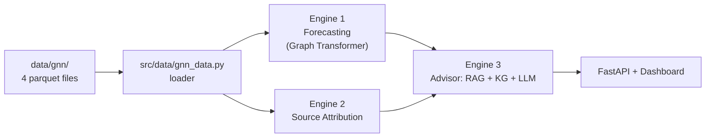

# 🌆 Urban Air Quality Intelligence — Delhi

> Hyperlocal, hourly Air Quality Index for **all 289 Delhi wards**. One graph dataset powers three engines: **forecasting**, **source attribution**, and **LLM-driven action recommendations**.

<p>
  
  
  
  
  
</p>

---

## Table of Contents

- [Overview](#overview)
- [Architecture](#architecture)
- [Project Structure](#project-structure)
- [Quick Start](#quick-start)
- [The Dataset](#the-dataset)
- [How the Three Engines Work](#how-the-three-engines-work)
- [Results](#results)
- [Gotchas That Will Save Your Results](#gotchas-that-will-save-your-results)
- [Rebuilding the Dataset](#rebuilding-the-dataset)
- [Limitations](#limitations)
- [License](#license)

---

## Overview

Free **hyperlocal** pollutant data does not exist. The pollutant and weather signal comes from
**CAMS — an atmospheric model with only 19 grid cells over Delhi** — so at any hour the raw inputs
carry ~4 distinct PM2.5 values for the whole city, not 289.

This project turns that coarse regional signal into a genuine **per-ward** product by fusing it with
real spatial context and real ground truth:

| Layer | Resolution | Real? |
|---|---|---|
| Pollutants + weather (CAMS) | 19 cells | Simulated |
| Roads, industry, population, land use | **289 wards** | Real |
| CPCB station measurements | 57 stations → 49 wards | **Real, measured** |
| Ward adjacency graph | 289 nodes, 1,670 edges | Real geometry |

The model **learns how ward context bends the coarse regional signal**, using real station
measurements as the answer key. This is a graph problem: 49 wards have ground truth, and the graph
carries it to the other 240.

**Highlights**

- ✅ Graph-Transformer forecaster (h+24 / +48 / +72) with a 4-member snapshot ensemble + conformal intervals
- ✅ Source attribution (dust vs. combustion) validated against a *measured* PM2.5/PM10 fingerprint
- ✅ RAG + Knowledge-Graph + LLM advisor served behind a FastAPI dashboard
- ✅ Compact, honest dataset: **47 MB on disk / 138 MB in RAM** (down from 5.3 GB, nothing lost)

---

## Architecture



---

## Project Structure

```text
.
├── src/                     # pipeline code (run as modules: python -m src.…)
│   ├── config.py            #   central config: paths, bbox, dates, API keys
│   ├── metrics.py           #   scoring: RMSE/MAE, coverage, pinball loss
│   ├── data/                #   getting & building the dataset
│   │   ├── download.py
│   │   ├── refresh_ground_truth.py
│   │   ├── preprocess_dataset.py
│   │   ├── build_gnn_dataset.py
│   │   ├── build_ward_static.py
│   │   ├── gnn_data.py      #   → the loader you use
│   │   └── stgnn_data.py    #   → spatio-temporal loader for training
│   ├── train/               #   model training
│   │   ├── train_gnn.py
│   │   ├── train_ensemble.py
│   │   ├── train_attribution.py
│   │   └── calibrate_conformal.py
│   ├── explain/             #   SHAP + GNNExplainer
│   │   └── explain_gnn.py
│   └── realtime/            #   live rolling-window ingestion
│       └── realtime_update.py
├── advisor/                 # RAG + KG + LLM advisor + FastAPI app + dashboard
├── models/                  # model definitions + trained checkpoints
├── data/
│   ├── gnn/                 # ★ the trainable dataset (4 parquet files)
│   ├── gnn_processed/       #   normalised tensors + scalers
│   └── kb/                  #   advisor knowledge base (corpus + graph)
├── docs/                    # dataset manifest + final model metrics
├── requirements.txt
└── README.md
```

---

## Quick Start

### 1. Install

```bash
python -m venv .venv && source .venv/bin/activate   # Windows: .venv\Scripts\activate
pip install -r requirements.txt
```

Tested on **Python 3.10**. For a GPU build of PyTorch, install it separately (see comments in
[`requirements.txt`](requirements.txt)).

### 2. Load the dataset

```python
from src.data.gnn_data import load_gnn

d = load_gnn(horizon=24)

x   = d.node_features(t=1000)        # [289, 84]      static ⧺ dynamic, joined for you
y   = d.targets(t=1000)              # [289]          CAMS target (weak — see gotchas)
seq = d.window(1000, lookback=24)    # [24, 289, 84]  for a sequence model
d.edge_index                         # (2, 1670)      ready for PyTorch Geometric
d.labels                             # the real CPCB answers
```

> **Note:** scripts live in a package, so run them as modules from the repo root —
> `python -m src.train.train_gnn`, **not** `python train_gnn.py`.

### 3. Train the forecaster

```bash
python -m src.train.train_gnn --horizon 24 --epochs 30
python -m src.train.train_ensemble --k 4 --residual --no-temporal --epochs 45
python -m src.train.calibrate_conformal          # prediction intervals
```

### 4. Serve the advisor

```bash
uvicorn advisor.api.main:app --reload --port 8000
# dashboard → http://127.0.0.1:8000
```

---

## The Dataset

Everything you train on lives in [`data/gnn/`](data/gnn/) — four files:

| File | Answers | Shape | Key |
|---|---|---|---|
| `nodes_static.parquet` | **Who** are the wards? | 289 × 42 | `node_idx`, `point_id` |
| `dynamic_grid.parquet` | **What's the air doing** each hour? | 499,776 × 80 | `point_id`, `time` |
| `edges.parquet` | **Who's next to whom?** | 1,670 × 6 | `src`, `dst` |
| `labels_station.parquet` | **What's true**, where we can check | 488,694 × 12 | `node_idx`, `time` |

The dynamic data has only **499,776 unique cell-hours** — every ward in a cell shares a
byte-identical copy, so it is stored once and joined at load time. The loader does a cheap gather:

```python
X_dyn[t][cell_of_node]     # [289, F] — effectively free
```

> ⚠️ Never materialise `[T, 289, F]` yourself — that's 1.8 GB of duplicated floats, the exact
> mistake the old flat table made.

<details>
<summary><b>Why the honest picture matters (click to expand)</b></summary>

An earlier version invented per-ward variation with a formula. It was **circular** — the formula's
inputs were also model inputs, so the model just re-derived it. That is deleted. Real variation now
comes from real ward features + the graph + real labels.

| Fixed | Was |
|---|---|
| **AQI target** | `rolling(24)` spanned 24 *rows*, not hours → one cell's AQI smeared **201→403** across its wards by sort order. Now verified correct. |
| **Ward features** | Roads/industry copied from nearest grid point → `road_km_3km` had **19** distinct values. Recomputed on ward geometry → **289**. |
| **Ground truth** | 6,453 rows → **488,694** (89×), checkpointed and resumable. |
| **Size** | 5.3 GB / 93 % duplicated → 138 MB, nothing lost. |

</details>

---

## How the Three Engines Work

### 🔮 Engine 1 — Forecasting
`d.node_features(t)` → Graph Transformer → AQI at t+24/48/72 for every ward. Pretrain on the dense
CAMS target, fine-tune on real labels. **Bar to clear:** persistence RMSE 86.03; a plain GBDT gets 73.98.

### 🧭 Engine 2 — Source Attribution
`ATTRIBUTION_DYN` + `ATTRIBUTION_STATIC` → a dust-vs-combustion signature per ward, **validated
against instruments**. `pm25_pm10_ratio_obs` is a *measured* fingerprint at 58 stations that flips
exactly as physics predicts — **0.62 in December** (combustion) vs **0.36 in April** (dust). Ratio
regression MAE **0.124** vs 0.177 baseline; source-class accuracy **0.601 vs 0.507** on `val`.

> ⚠️ Report this engine from `val`, not `test` (the test window is summer → 67.5 % dust, so
> "always say dust" wins there). **Never claim** *"industry = 34 % of PM2.5"* — no source labels
> exist and 6 pollutants aren't chemical speciation.

### 💬 Engine 3 — Action Recommendation (RAG + LLM)
The dataset supplies **retrieval context**, not the arithmetic:

- **Who's at risk** — `population_sum`, `population_density_mean`, `vulnerable_sites_3km` (real per-ward)
- **What's coming** — predicted AQI + `dominant_pollutant` from Engines 1–2
- **Where** — `ward_name`, `ward_lat/lon` to ground the retrieved text

You supply the corpus (CPCB/GRAP action tiers, health advisories); retrieve on
(AQI band × dominant pollutant × vulnerability) and let the LLM compose the advice.
**Keep the LLM out of the arithmetic — it should cite, not compute.**

---

## Results

**Final served model** — 4-member snapshot ensemble (dropout 0.3), horizon 24, conformal intervals.
`skill` = % better than the persistence baseline.

| Split | RMSE | MAE | Skill vs. persistence | p10–90 coverage | n |
|---|---|---|---|---|---|
| train | 38.88 | 26.64 | **+35.5 %** | 0.94 | 81,180 |
| **val** (winter) | 69.49 | 49.94 | **+11.3 %** | 0.80 | 20,617 |
| test (summer) | 53.25 | 39.70 | **+24.2 %** | 0.82 | 18,848 |

> **`val` is the honest generalisation metric** — it contains winter, when Delhi's air is worst
> (Nov mean AQI 368 vs Jul 77). Full numbers in [`docs/FINAL_MODEL_METRICS.txt`](docs/FINAL_MODEL_METRICS.txt).

---

## Gotchas That Will Save Your Results

**1. Use the right split.** Real labels only start **Feb 2025** (~17 months, not 3 years).

| Column | Where | Use for |
|---|---|---|
| `split` | `dynamic_grid` | CAMS pretraining only |
| `split_lab` | `labels_station` | **all real-label training/eval** |

The full-range `split` puts 5.9 % winter in train but 53 % in val — training on clean air,
validating on smog. `split_lab` fixes this. Its test window is summer-only, so **you cannot claim
winter skill from the test set — report it from `val`.**

**2. Never split randomly, never trust the row count.** Adjacent hours are near-duplicates and
wards in a cell share inputs exactly — a random split leaks. For CV on grid-derived features,
**group by `point_id`**: you have **19 independent locations**, not 289.

---

## Rebuilding the Dataset

Run as modules from the repo root:

```bash
python -m src.data.build_ward_static             # nodes + edges          ~1 min
python -m src.data.build_gnn_dataset             # dynamic grid           ~2 min
python -m src.data.refresh_ground_truth          # CPCB pull (resumable)  ~75 min
python -m src.data.build_gnn_dataset --labels    # station labels
python -m src.data.gnn_data                       # smoke-test
```

`refresh_ground_truth` checkpoints every sensor — re-running skips cached ones; `--assemble`
rebuilds the CSV from cache without re-pulling.

<details>
<summary><b>Raw download pipeline (only if starting from scratch)</b></summary>

```bash
python -m src.data.download              # everything
python -m src.data.download aqi weather  # selected datasets
```

Free API keys (env vars, or edit [`src/config.py`](src/config.py)):

| Variable | From | For |
|---|---|---|
| `OPENAQ_API_KEY` | explore.openaq.org/register | CPCB stations |
| `CDSAPI_KEY` | cds.climate.copernicus.eu | ERA5 weather |
| `FIRMS_MAP_KEY` | firms.modaps.eosdis.nasa.gov/api/map_key/ | Fire |
| `EARTHDATA_TOKEN` | urs.earthdata.nasa.gov | MODIS AOD |

Roads, industry, land use, DEM and population need no key. Missing keys skip that dataset only, and
re-running is safe (existing files are skipped). Sources/licenses: [`docs/datasets.json`](docs/datasets.json).
</details>

---

## Limitations

Stated out loud, because honesty about these matters more than hiding them:

1. **Pollutants/weather are 19 CAMS cells** broadcast to wards; per-ward signal comes from static features + graph + labels.
2. **~19 effective spatial samples** for grid-derived features.
3. **Only 49/289 wards (17 %) have a real label** — the rest are inferred (validated on 49, asserted on 240).
4. **Emissions are annual** (EDGAR v8.1) — no hourly industrial activity.
5. **No construction, real traffic counts, or satellite-imagery encoders.**
6. **Bias correction is still 12 hand-tuned monthly scalars** — with 488k real labels the model should now learn this itself (highest-value next step).
7. **Uncertainty is conformal-only** — native quantile heads (0.1/0.5/0.9) are a cheap upgrade.

---


