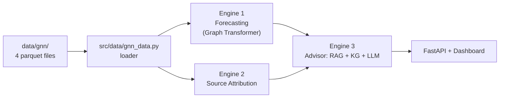
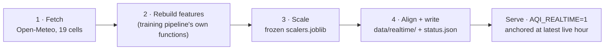

# 🌆 AIRIS - Hyperlocal AQI Intelligence

> Hyperlocal, hourly Air Quality Index for **all 289 Delhi wards**. One graph dataset powers three engines: **forecasting**, **source attribution**, and **LLM-driven action recommendations**.

<p>
  
  
  
  
  
</p>

---

## Table of Contents

- [Overview](#overview)
- [Architecture](#architecture)
- [Project Structure](#project-structure)
- [Quick Start](#quick-start)
- [The Dataset](#the-dataset)
- [How the Three Engines Work](#how-the-three-engines-work)
- [Results](#results)
- [Gotchas That Will Save Your Results](#gotchas-that-will-save-your-results)
- [Rebuilding the Dataset](#rebuilding-the-dataset)
- [Limitations](#limitations)
- [License](#license)

---

## Overview

This is an end-to-end **ward-level air-quality intelligence platform** for Delhi: it forecasts the Air
Quality Index for all **289 wards**, explains *why* the air is bad, and turns that into concrete,
cited health guidance served live behind a dashboard.

The solution is built in four layers that stack on top of one another:

**1 · A fused graph dataset:** A single graph ties together three kinds of data  a coarse regional
pollutant/weather field (CAMS/ERA5, 19 grid cells), high-resolution per-ward geography (roads,
industry, population, land use across 289 wards), and real CPCB station measurements as ground truth.
Wards are the nodes; true geographic adjacency forms the 1,670 edges. This is what lets a coarse
city-wide signal become a per-ward prediction.

**2 · Forecasting engine:** A Graph-Transformer learns how each ward's local context bends the regional
signal, predicting AQI at **+24 / +48 / +72 hours** for every ward. It's served as a 4-member snapshot
ensemble with conformal prediction intervals, so every forecast ships with a calibrated uncertainty
band not just a point estimate.

**3 · Source attribution engine:** Beyond *how bad*, the system estimates *why* separating
dust-driven pollution from combustion-driven pollution per ward. Critically, this is **validated
against a measured PM2.5/PM10 fingerprint** at real stations, so it's a scoreable prediction, not a
heuristic.

**4 · Action advisor:** A retrieval-augmented layer (RAG + Knowledge Graph + LLM) takes the forecast
and attribution, retrieves the right official guidance (CPCB/GRAP tiers, health advisories) for that
ward's risk profile, and composes grounded, **cited** recommendations. The LLM writes the advice but
never does the arithmetic the numbers come from the models.

Tying it together: a **live ingestion path** keeps the whole stack anchored to `now`, pulling fresh
data hourly and rebuilding it in the exact format the frozen models expect (see
[Live Data Integration](#live-data-integration)), and the entire thing is exposed through a **FastAPI
service and dashboard**. 
>This project turns that coarse regional signal into a genuine **per-ward** product by fusing it with
real spatial context and real ground truth:

| Layer | Resolution | Real? |
|---|---|---|
| Pollutants + weather (CAMS) | 19 cells | Real |
| Roads, industry, population, land use | **289 wards** | Real |
| CPCB station measurements | 57 stations → 49 wards | **Real, measured** |
| Ward adjacency graph | 289 nodes, 1,670 edges | Real geometry |

The model **learns how ward context bends the coarse regional signal**, using real station
measurements as the answer key. This is a graph problem: 49 wards have ground truth, and the graph
carries it to the other 240.

**Highlights**

- ✅ Graph-Transformer forecaster (h+24 / +48 / +72) with a 4-member snapshot ensemble (STGNN) + conformal intervals
- ✅ Source attribution (dust vs. combustion) validated against a *measured* PM2.5/PM10 fingerprint
- ✅ Hourly live data pipeline with identical training-time preprocessing, enabling real-time AQI forecasts without train/serve skew
- ✅ RAG + Knowledge-Graph + LLM advisor served behind a FastAPI dashboard
  
---

## Architecture



---

## Project Structure

```text
.
├── src/                     # pipeline code (run as modules: python -m src.…)
│   ├── config.py            #   central config: paths, bbox, dates, API keys
│   ├── metrics.py           #   scoring: RMSE/MAE, coverage, pinball loss
│   ├── data/                #   getting & building the dataset
│   │   ├── download.py
│   │   ├── refresh_ground_truth.py
│   │   ├── preprocess_dataset.py
│   │   ├── build_gnn_dataset.py
│   │   ├── build_ward_static.py
│   │   ├── gnn_data.py      #   → the loader you use
│   │   └── stgnn_data.py    #   → spatio-temporal loader for training
│   ├── train/               #   model training
│   │   ├── train_gnn.py
│   │   ├── train_ensemble.py
│   │   ├── train_attribution.py
│   │   └── calibrate_conformal.py
│   ├── explain/             #   SHAP + GNNExplainer
│   │   └── explain_gnn.py
│   └── realtime/            #   live rolling-window ingestion
│       └── realtime_update.py
├── advisor/                 # RAG + KG + LLM advisor + FastAPI app + dashboard
├── models/                  # model definitions + trained checkpoints
├── data/
│   ├── gnn/                 # ★ the trainable dataset (4 parquet files)
│   ├── gnn_processed/       #   normalised tensors + scalers
│   └── kb/                  #   advisor knowledge base (corpus + graph)
├── docs/                    # dataset manifest + final model metrics
├── requirements.txt
└── README.md
```

---

## Quick Start

### 1. Install

```bash
python -m venv .venv && source .venv/bin/activate   # Windows: .venv\Scripts\activate
pip install -r requirements.txt
```

Tested on **Python 3.10**. For a GPU build of PyTorch, install it separately (see comments in
[`requirements.txt`](requirements.txt)).

### 2. Load the dataset

```python
from src.data.gnn_data import load_gnn

d = load_gnn(horizon=24)

x   = d.node_features(t=1000)        # [289, 84]      static ⧺ dynamic, joined for you
y   = d.targets(t=1000)              # [289]          CAMS target (weak — see gotchas)
seq = d.window(1000, lookback=24)    # [24, 289, 84]  for a sequence model
d.edge_index                         # (2, 1670)      ready for PyTorch Geometric
d.labels                             # the real CPCB answers
```

> **Note:** scripts live in a package, so run them as modules from the repo root —
> `python -m src.train.train_gnn`, **not** `python train_gnn.py`.

### 3. Train the forecaster

```bash
python -m src.train.train_gnn --horizon 24 --epochs 30
python -m src.train.train_ensemble --k 4 --residual --no-temporal --epochs 45
python -m src.train.calibrate_conformal          # prediction intervals
```

### 4. Serve the advisor

```bash
uvicorn advisor.api.main:app --reload --port 8000
# dashboard → http://127.0.0.1:8000
```

---

## The Dataset


| File | Answers | Shape | Key |
|---|---|---|---|
| `nodes_static.parquet` | **Who** are the wards? | 289 × 42 | `node_idx`, `point_id` |
| `dynamic_grid.parquet` | **What's the air doing** each hour? | 499,776 × 80 | `point_id`, `time` |
| `edges.parquet` | **Who's next to whom?** | 1,670 × 6 | `src`, `dst` |
| `labels_station.parquet` | **What's true**, where we can check | 488,694 × 12 | `node_idx`, `time` |

The dynamic data has only **499,776 unique cell-hours** — every ward in a cell shares a
byte-identical copy, so it is stored once and joined at load time. The loader does a cheap gather:

```python
X_dyn[t][cell_of_node]     # [289, F] — effectively free
```

---

## How the Three Engines Work

### 🔮 Engine 1 : Forecasting
`d.node_features(t)` → Graph Transformer → AQI at t+24/48/72 for every ward. Pretrain on the dense
CAMS target, fine-tune on real labels. **Bar to clear:** persistence RMSE 86.03; a plain GBDT gets 73.98.

### 🧭 Engine 2 : Source Attribution
`ATTRIBUTION_DYN` + `ATTRIBUTION_STATIC` → a dust-vs-combustion signature per ward, **validated
against instruments**. `pm25_pm10_ratio_obs` is a *measured* fingerprint at 58 stations that flips
exactly as physics predicts — **0.62 in December** (combustion) vs **0.36 in April** (dust). Ratio
regression MAE **0.124** vs 0.177 baseline; source-class accuracy **0.601 vs 0.507** on `val`.


### 💬 Engine 3 : Action Recommendation (RAG + LLM)
The dataset supplies **retrieval context**, not the arithmetic:

- **Who's at risk**-> `population_sum`, `population_density_mean`, `vulnerable_sites_3km` (real per-ward)
- **What's coming** -> predicted AQI + `dominant_pollutant` from Engines 1–2
- **Where** -> `ward_name`, `ward_lat/lon` to ground the retrieved text

You supply the corpus (CPCB/GRAP action tiers, health advisories); retrieve on
(AQI band × dominant pollutant × vulnerability) and let the LLM compose the advice.
**LLM is kept out of arithmetic ; It should cite, not compute.**

---
## Live Data Integration

A forecasting system trained on three years of history is only useful if it can also speak to the
present. If the advisor could only answer questions about a fixed hour buried somewhere in the
training window, it would be a museum piece, not a decision tool. So the whole serving path is built
around one goal: **the model should forecast from `now`**, using data that is genuinely current yet
completely indistinguishable in shape, units, scale, and meaning from the data it learned on.

That last clause is the entire engineering challenge. Pulling recent numbers off an API is trivial.
The hard, failure-prone part is guaranteeing that a live row is processed through the *exact same*
transformations as a training row, so that the frozen model never sees anything it wasn't trained to
understand. Any drift between the two ,a differently computed feature, a re-fitted scaler, a
mismatched column order is **train/serve skew**, and it silently degrades predictions in ways that
are almost impossible to debug after the fact. An hourly job,
[`src/realtime/realtime_update.py`](src/realtime/realtime_update.py), exists to close that gap
completely. It runs on a schedule, rebuilds the most recent hours in the model's native format, and
drops them into `data/realtime/`, from which the advisor serves live forecasts.


## Results

**Final served model** — 4-member snapshot ensemble (dropout 0.3), horizon 24, conformal intervals.
`skill` = % better than the persistence baseline.

| Split | RMSE | MAE | Skill vs. persistence | p10–90 coverage | n |
|---|---|---|---|---|---|
| train | 38.88 | 26.64 | **+35.5 %** | 0.94 | 81,180 |
| **val** (winter) | 69.49 | 49.94 | **+11.3 %** | 0.80 | 20,617 |
| test (summer) | 53.25 | 39.70 | **+24.2 %** | 0.82 | 18,848 |

> **`val` is the honest generalisation metric** — it contains winter, when Delhi's air is worst
> (Nov mean AQI 368 vs Jul 77). Full numbers in [`docs/FINAL_MODEL_METRICS.txt`](docs/FINAL_MODEL_METRICS.txt).

---

---

## Rebuilding the Dataset

Run as modules from the repo root:

```bash
python -m src.data.build_ward_static             # nodes + edges          ~1 min
python -m src.data.build_gnn_dataset             # dynamic grid           ~2 min
python -m src.data.refresh_ground_truth          # CPCB pull (resumable)  ~75 min
python -m src.data.build_gnn_dataset --labels    # station labels
python -m src.data.gnn_data                       # smoke-test
```

`refresh_ground_truth` checkpoints every sensor — re-running skips cached ones; `--assemble`
rebuilds the CSV from cache without re-pulling.

<details>
<summary><b>Raw download pipeline (only if starting from scratch)</b></summary>

```bash
python -m src.data.download              # everything
python -m src.data.download aqi weather  # selected datasets
```

Free API keys (env vars, or edit [`src/config.py`](src/config.py)):

| Variable | From | For |
|---|---|---|
| `OPENAQ_API_KEY` | explore.openaq.org/register | CPCB stations |
| `CDSAPI_KEY` | cds.climate.copernicus.eu | ERA5 weather |
| `FIRMS_MAP_KEY` | firms.modaps.eosdis.nasa.gov/api/map_key/ | Fire |
| `EARTHDATA_TOKEN` | urs.earthdata.nasa.gov | MODIS AOD |

Roads, industry, land use, DEM and population need no key. Missing keys skip that dataset only, and
re-running is safe (existing files are skipped). Sources/licenses: [`docs/datasets.json`](docs/datasets.json).
</details>

---
## Future Scope

### Coverage & ground truth
- Add more monitors (IMD, DPCC low-cost sensors, PurpleAir) to push labelled ward coverage past 49.
- Fuse satellite NO₂ / aerosol (Sentinel-5P) for genuine sub-cell texture beyond the 19 CAMS cells.

### Model & ops
- Learn the bias correction instead of 12 hand-tuned monthly scalars, now that real labels exist.
- Online fine-tuning on the new live data stream; multi-city generalisation beyond Delhi.

### Reach
- SMS / IVR alerts and a low-bandwidth mode for residents on patchy connectivity.
- Warm handoffs to DPCC / CAQM workflows for officials acting on a ward-level advisory.

### National expansion
- Expand to other Indian cities using CPCB, weather, traffic, and satellite data.
- Auto-generate city graphs for nationwide ward-level AQI forecasting and policy support.


